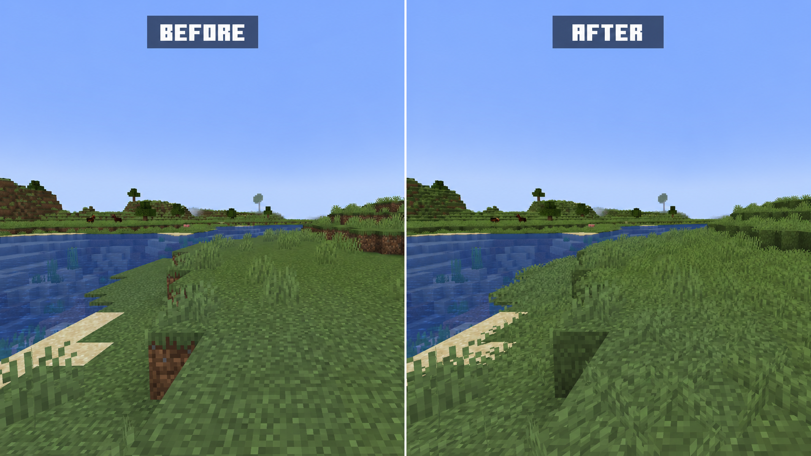

  

# Lush Grass

Lush Grass is a lightweight, vanilla-style client visual mod for Minecraft
1.20.1 on Fabric.

## Features

- Enhances vanilla grass blocks so grasslands look lusher while retaining the
  vanilla style.
- Provides a connected-texture appearance for grass blocks, creating more
  natural visual transitions between adjacent grass blocks.
- Provides complete snowy grass-block coverage for a cleaner appearance in
  snowy environments.
- Renders grass tufts on unobstructed grass blocks to add depth and variety to
  grasslands.
- Provides client-side configuration with independent controls for grass-block
  coverage and grass-tuft rendering.
- Integrates with Sodium and Iris so added grass tufts use vanilla short-grass
  shader materials, including shader-pack vegetation movement where supported.

## Requirements

- Minecraft 1.20.1
- Fabric Loader 0.15.11 or newer
- Fabric API 0.92.2+1.20.1 or newer

Server installation is not required.

## Optional Compatibility

- Mod Menu 7.2.2 provides the in-game configuration entry.
- Sodium 0.5.13 and Iris 1.7.6 are supported and tested.
- Indium 1.0.36 is compatible but not required.

Sodium, Iris, Mod Menu, and Indium are all optional. When Sodium and Iris are
installed, Lush Grass marks its additional grass geometry as vanilla short grass
for shader material mapping.

## Configuration

With Mod Menu installed, open **Mods > Lush Grass > Configure**, then select
**Visuals** to change the two rendering options in game.

The client configuration is stored in `config/lush_grass-client.json`.

| Option | Default | Description |
| --- | --- | --- |
| `full_grass_block_coverage` | `true` | Improves vanilla grass blocks with continuous grass coverage. |
| `render_grass_tufts` | `true` | Renders short grass on unobstructed vanilla grass blocks. |

Changing either option refreshes the affected chunks.

## License

- Lush Grass is licensed under the [MIT License](LICENSE).
- Third-party notices: [NOTICE](NOTICE)
