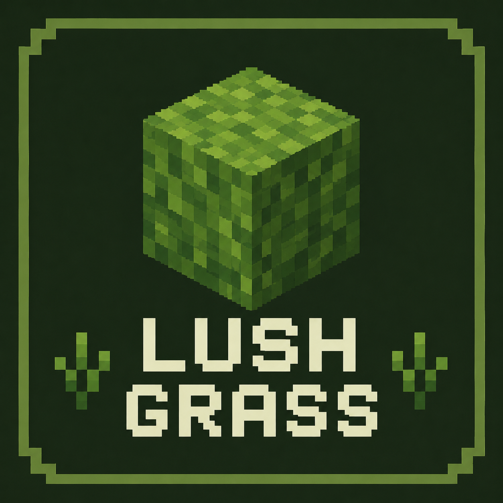
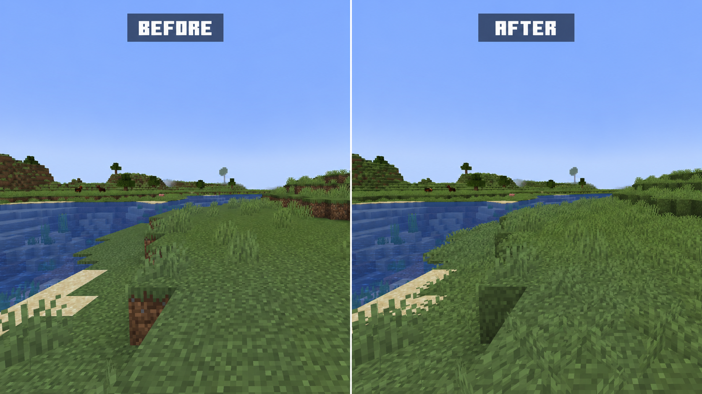

<p align="center">
  
</p>

# Lush Grass

Lush Grass 是一个用于 Minecraft 1.21.1 NeoForge 的轻量原版风格视觉与世界生成模组。



## 功能

- 改进原版草方块的外观。
- 在上方无遮挡的草方块上渲染可配置的短草。
- 添加可放置的低矮草丛，并让它参与原版草丛生成。
- 支持通过资源包和数据包自定义。

## 运行要求

- Minecraft 1.21.1
- 适用于 Minecraft 1.21.1 的 NeoForge 21.1.152 或更高版本
- Java 21

## 配置

客户端配置文件位于 `config/lush_grass-client.toml`。

| 配置项 | 默认值 | 说明 |
| --- | --- | --- |
| `visuals.full_grass_block_coverage` | `true` | 使用连续草面改进原版草方块外观。 |
| `visuals.render_grass_tufts` | `true` | 在上方无遮挡的原版草方块上渲染短草。 |

修改任一配置项后，相关区块会自动刷新。

## 资源包与数据包

资源包无需编写代码即可自定义低矮草丛：

- 覆盖 `assets/lush_grass/blockstates/low_grass.json`，可以指定单个模型或多个带权重模型。
- 覆盖 `assets/lush_grass/models/block/low_grass.json` 和
  `assets/lush_grass/models/item/low_grass.json`，可以分别修改方块与物品外观。
- 覆盖 `assets/lush_grass/models/block/grass_tuft.json`，可以修改草方块附加短草所使用的模型。

资源包可以为现有低矮草丛制作视觉变种；如果需要独立方块 ID，仍然需要模组注册。

数据包可以覆盖 `data/lush_grass/worldgen/configured_feature` 中的文件，
调整原版矮草丛与低矮草丛之间的比例：

| 原版矮草丛权重 | 低矮草丛权重 | 低矮草丛占比 |
| --- | --- | --- |
| `3` | `1` | 25% |
| `1` | `1` | 50% |
| `1` | `3` | 75% |
| 保留 | 删除低矮草丛条目 | 关闭 |

`data/lush_grass/neoforge/biome_modifier` 中的生物群系修改器决定替换哪些原版特征。
蕨类等其他条目可以保持不变。

启用 `visuals.full_grass_block_coverage` 时，Lush Grass 会使用自己的全覆盖草方块模型。
如果连接纹理资源包需要直接控制原版草方块模型，请关闭该选项。

## 开发

```powershell
.\gradlew.bat runData
.\gradlew.bat build
.\gradlew.bat runClient
```

生成的数据位于 `src/generated/resources` 并提交到仓库，其中 `.cache` 目录会被忽略。

## 许可证

- 源代码：[BSD 3-Clause](LICENSE)
- 原创非代码资源：[CC BY-NC-SA 4.0](LICENSE-ASSETS)
- 第三方声明：[NOTICE](NOTICE)
